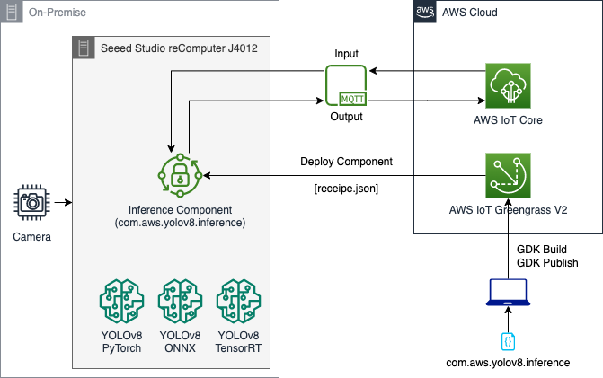

# Deploy and Test a YOLOv8 model on an Edge device
This aim of this project is to deploy a [YOLOv8](https://github.com/ultralytics/ultralytics)* PyTorch/ONNX/TensorRT model on an Edge device (NVIDIA Orin or NVIDIA Jetson) and test it. The project utilizes AWS IoT Greengrass V2 to deploy the inference component. It utiliizes MQTT message to start/pause/stop inference and also to generate output and push it to AWS Cloud. 

(*) NOTE: YOLOv8 is distributed under the GPLv3 license.

For YOLOv8 TensorFlow deployment on SageMaker Endpoint, kindly refer to the [GitHub](https://github.com/aws-samples/host-yolov8-on-sagemaker-endpoint) and the [Blog on YOLOv8 on SageMaker Endpoint](https://aws.amazon.com/blogs/machine-learning/hosting-yolov8-pytorch-model-on-amazon-sagemaker-endpoints/)

For YOLOv5 TensorFlow deployment on SageMaker Endpoint, kindly refer to the [GitHub](https://github.com/aws-samples/host-yolov5-on-sagemaker-endpoint) and the [Blog on YOLOv5 on SageMaker Endpoint](https://aws.amazon.com/blogs/machine-learning/scale-yolov5-inference-with-amazon-sagemaker-endpoints-and-aws-lambda/)

## AWS Architecture:


### (1) How to Setup Edge Device with IoT Greengrass V2?
- Use the [Blog](https://aws.amazon.com/blogs/iot/using-aws-iot-greengrass-version-2-with-amazon-sagemaker-neo-and-nvidia-deepstream-applications/) to provision an edge device like NVIDIA Jetson with IoT Greengrass V2. 
- Alternatively, you can use the following script and run in the Edge Device:
    ```
    [On Edge Device]
    $ git clone https://github.com/aws-samples/deploy-yolov8-on-edge-using-aws-iot-greengrass
    $ cd deploy-yolov8-on-edge-using-aws-iot-greengrass/com.aws.yolov8.inference/
    $ chmod u+x provisioning.sh
    $ ./provisioning.sh
    ```
    - The `provisioning.sh` script only works for Ubuntu based system.
    - It would prompt for AWS Credentials which can be bypassed if already configured by clicking Enter.
    - It would prompt for providing name of `IoT Thing` & `IoT Thing Group` and if not entered, would take default values.
    - Once completed, the `IoT Thing` and its `IoT Thing Group` would be available on the AWS Console.

### (2) How to build/publish/deploy component on the Edge Device from a Personal Laptop or EC2 Instance?
1. Get started with cloning the repository on a Personal Laptop / EC2 Instance which is Configured to AWS as follows:
    ```
    [On Personal Laptop / EC2 Instance - Configured to AWS]
    $ git clone https://github.com/aws-samples/deploy-yolov8-on-edge-using-aws-iot-greengrass
    ```
2. Edit the details of the AWS Account, `IoT Thing` and `IoT Thing Group` in the `com.aws.yolov8.inference/deploy-gdk-config.sh` as follows:
    ```
    AWS_ACCOUNT_NUM="ADD_ACCOUNT_NUMBER"
    AWS_REGION="ADD_REGION"
    DEV_IOT_THING="NAME_OF_OF_THING"
    DEV_IOT_THING_GROUP="NAME_OF_IOT_THING_GROUP"
    ```
3. Download YOLOv8 models on the Edge Device. Convert the models to ONNX and TensorRT if required:
    - There is a suite of models to select from:
        - Detection (yolov8n.pt, yolov8m.pt, yolov8l.pt, yolov8s.pt, yolov8x.pt)
        - Segmentation (yolov8n-seg.pt, yolov8m-seg.pt, yolov8l-seg.pt, yolov8s-seg.pt, yolov8x-seg.pt)
        - Classification (yolov8n-cls.pt, yolov8m-cls.pt, yolov8l-cls.pt, yolov8s-cls.pt, yolov8x-cls.pt)    
    - Download the PyTorch models as follows and also convert into ONNX:
        ```
        [On Edge Device]
        $ pip3 install ultralytics
        $ cd {edge/device/path/to/models}
        $ yolo export model=yolov8n.pt OR yolov8n-seg.pt OR yolov8n-cls.pt
        $ yolo export model=yolov8n.pt OR yolov8n-seg.pt OR yolov8n-cls.pt format=onnx
        ```
    - In order to run TensorRT models, it is advisable to convert the ONNX models to TensorRT models using the following methods directly on the Edge Device:
        ```
        [On NVIDIA based Edge Device]
        $ apt-get install tensorrt
        $ alias trtexec="/usr/src/tensorrt/bin/trtexec"
        $ trtexec --onnx={edge/device/path/to/models}/yolov8n.onnx --saveEngine={edge/device/path/to/models}/yolov8n.trt
        ```
4. Edit the right model location and the camera to be used in the `com.aws.yolov8.inference/greengrass/recipe.json` as follows:
    ```
    "Configuration": 
    {
        "event_topic": "inference/input",
        "output_topic": "inference/output",
        "camera_id": "0", OR "samples/video.mp4",
        "model_loc": "{edge/device/path/to/models}/yolov8n.trt" OR "{edge/device/path/to/models}/yolov8n.onnx" OR "{edge/device/path/to/models}/yolov8n.pt"
    }
    ```
5. Build/Publish/Deploy the component as follows:
    ```
    [On Personal Laptop / EC2 Instance - Configured to AWS]
    $ cd com.aws.yolov8.inference/
    $ chmod u+x deploy-gdk-build.sh
    $ ./deploy-gdk-build.sh
    ```
6. After a few seconds, the component will be published to the AWS Account and will be deployed in the designated Edge device.

### (3) How to run inference and obtain output?

1. From AWS Console, go to AWS IoT Core and select MQTT test client.
    a. Subscribe to the topic `inference/output`.
    b. The subscribed topic should be shown in the active subscriptions.
2. Select Publish to a topic and select `inference/input`.
3. Select `start`, `pause` or `stop` for starting/pausing/stopping inference.
4. Once the inference starts, you can see the output returning to the console.

### (4) YOLOv8 Comparison on various NVIDIA Edge Devices:
```
    |---------------------------|---------------------------------------|
    |           NVIDIA          |       **YOLOv8 Performance FPS**      |
    |            Edge           |---------------------------------------|
    |           Device          | **PyTorch** | **ONNX** | **TensorRT** |
    |---------------------------|-------------|----------|--------------|
    | **Orin AGX Devkit**       |     5.6     |   17.8   |     27.5     |
    | **Xavier AGX Devkit**     |     4.5     |   12.4   |     22.7     |
    | **Orin AGX Seeed Studio** |             |          |              |
    | **Orin NX Seeed Studio**  |             |          |              |
    |---------------------------|-------------|----------|--------------|
```

### (5) Cleanup of the GG Components and Deployment
- Use the `com.aws.yolov8.inference/cleanup_gg.py` to clean the Greengrass Components and Deployment. 
- In the `com.aws.yolov8.inference/cleanup_gg.py`, change the following as per the AWS Account and IoT device details:
    ```
    AWS_ACCOUNT_NUM="ADD_ACCOUNT_NUMBER"
    AWS_REGION="ADD_REGION"
    DEV_IOT_THING="NAME_OF_OF_THING"
    DEV_IOT_THING_GROUP="NAME_OF_IOT_THING_GROUP"
    ```
- Run the code as follows to cleanup:
    ```
    [On Personal Laptop / EC2 Instance - Configured to AWS]
    $ cd com.aws.yolov8.inference/
    $ python3 cleanup_gg.py
    ```

## Contributors:
- [Romil Shah (@rpshah)](rpshah@amazon.com)
- [Kevin Song (@kcsong)](kcsong@amazon.com)
